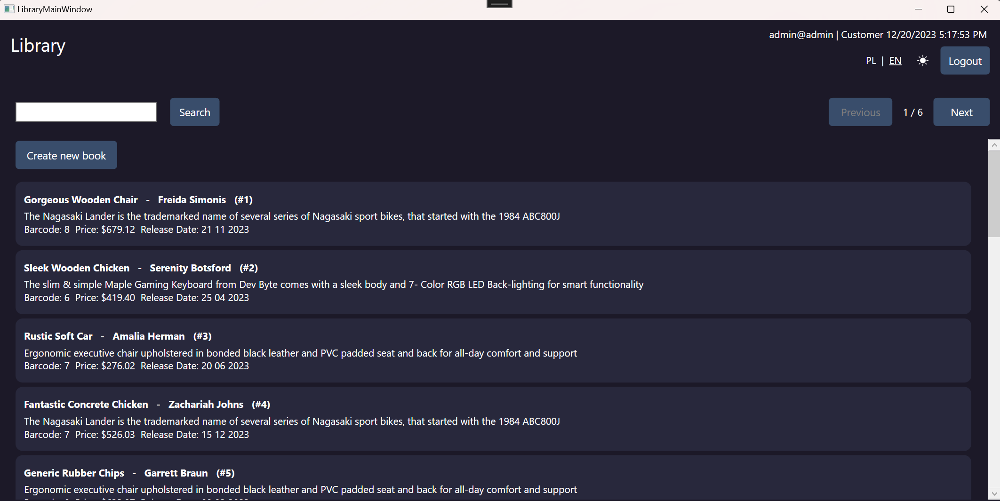
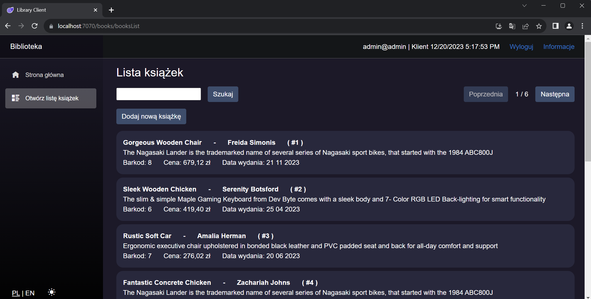
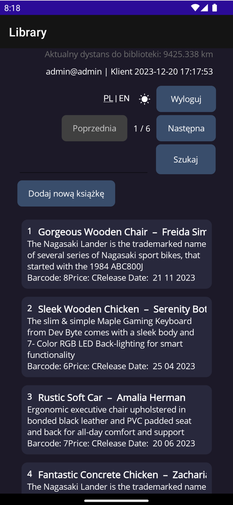
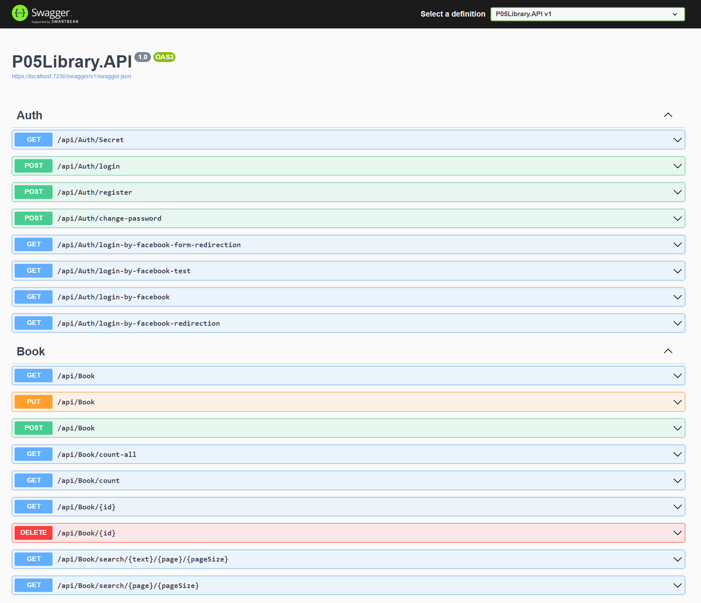
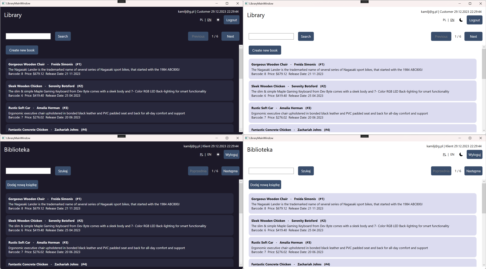

# Projekt na programowanie aplikacji mobilnych i webowych

## Omówienie

Projekt miał na celu stworzenie zestawu aplikacji: interfejsu API, aplikacji typu desktop, aplikacji WebAssembly oraz aplikacji mobilnej. W realizacji zadania posłużyłem się projektami wykonywanymi na laboratoriach. Wykorzystałem rozwiązania od Microsoftu w języku C#:
- internetowy interfejs API platformy ASP.NET Core
- aplikacja WPF
- aplikacja Blazor WebAssembly
- aplikacja MAUI

API oraz baza danych SQL zostały przeniesione do **Google Cloud Platform**, dzięki temu mamy do nich publiczny dostęp. Api znajduje się pod adresem: https://handy-freedom-408622.nw.r.appspot.com. Możemy przetestować jego działanie w przeglądarce wykorzystując endpoint pobierania listy książek (żądanie GET): https://handy-freedom-408622.nw.r.appspot.com/api/Book.

## Internetowy interfejs API

Projekt można uruchomić w dwóch środowiskach: **Development** i **Production**. Aby je zmienić należy odpowiednio ustawić zmienną środowiskową **ASPNETCORE_ENVIRONMENT** wykorzystując komendy **$env:ASPNETCORE_ENVIRONMENT = "Development"** oraz **$env:ASPNETCORE_ENVIRONMENT = "Production"**.
W środowisku **Development** do prawidłowego funkcjonowania wymagany jest uruchomiony w tle projekt **P05Library.API**, natomiast w przypadku **Production** posługujemy się publicznym adresem do API działającego na serwerze w Google Cloud Platform.


## Wdrożenie API do usługi chmurowej

Wykorzystałem usługę **App Engine** w Google Cloud Platform. Aby przeprowadzić wdrożenie przygotowałem specjalną wersję projektu **P05Library.API** (znajdującą się w katalogu **DeployedAPI**), w której obniżyłem środowisko dotnet do wersji 6.0 oraz scaliłem serwisy z projektu **P06Library.Shared**, ponieważ było to wymagane przez Google Cloud Platform (obsługiwane wdrożenie **jednego** pliku projektu w wersji **dotnet 6.0**).

Aby wdrożyć projekt umieściłem w jego katalogu plik **app.yaml** zawierający odpowiednią konfigurację środowiska:

```yaml
runtime: aspnetcore
env: flex

runtime_config:
  operating_system: ubuntu22

manual_scaling:
  instances: 1
resources:
  cpu: 1
  memory_gb: 0.5
  disk_size_gb: 10
```

Następnie posłużyłem się Google Cloud CLI, najpierw odpowiednio komendami: ***gcloud init***, ustawiłem aktualny projekt ***gcloud config set project handy-freedom-408622***. Przy skonfigurowanym środowisku uruchomiłem wdrożenie poprzez ***gcloud app deploy app.yaml***. Po wdrożeniu można otworzyć stronę w przeglądarce poprzez ***gcloud app browse*** (w naszym przypadku będzie pusta, bo jest to projekt API).

## Wygląd interfejsów aplikacji oraz obsługa ustawień użytkownika

Każda aplikacja ma wbudowaną możliwość zmiany motywu (**jasny**/**ciemny**) oraz języka (**angielski**/**polski**). Wszystkie programy mają ten sam styl wizualny:

**Aplikacja desktop (WPF)**



**P11BlazorWebAssembly.Client**



**P12MAUI.Client**



**P05Library.API** - interfejs Swaggera pokazujący używane endpointy interfejsu API



**Prezentacja motywów i języków**

Motywy i języki można łatwo zmienić klikając na ikony znajdujące się na stronie głównej w każdej aplikacji. Zostały użyte ikony w postaci wektorowej, co zapewnia bezstratną jakość przy dowolnym powiększeniu oraz jednakową stylistykę w aplikacji. Ikony pozyskałem z biblioteki bootstrap – użyłem zapisu SVG udostępnionego na stronie biblioteki: https://icons.getbootstrap.com/ (w projekcie Blazor WebAssembly ikony bootstrap zostały skonfigurowane i można ich użyć wykorzystując odpowiednią wartość atrybutu **class**).



**Spójność wizualna**

Wszystkie interfejsy zostały zaprojektowane tak, by implementowały spójną stylistykę. W każdym projekcie wykorzystano te same style wizualne, które można zobaczyć na powyższych zdjęciach.

**Oczekiwanie na dłuższe operacje**

Każda długa operacja (ładowania, logowania, itp.) została zasygnalizowana animacją ładującego się koła.


**Walidacja danych**

Wprowadzane we wszystkich formularzach dane są walidowane zarówno w API (odpowiedź zawiera komunikat błędu), jak i w UI (użytkownik dostaje stosowny komunikat w formie odpowiadającej dla danej platformy).

## Logowanie poprzez Facebooka

We wszystkich aplikacjach został zaimplementowany własny schemat logowania z wykorzystaniem autentykacji poprzez serwis Facebook. Schemat jest następujący:
- W aplikacjach klienckich zostaje otwarta przeglądarka z adresem URL wskazującym na endpoint w API
- Serwer API przekierowuje nas na odpowiednio utworzony adres do API Facebooka, wraz ze zdefiniowanym adresem ***redirect_uri*** – adres, na który zostaniemy przekierowani po zakończeniu autentykacji w serwisie
- Przeglądarka sprawdza przekierowywane adresy, gdy rozpozna utworzony adres ***redirect_uri*** wczytuje z niego uzyskany kod
- Kod jest wysyłany do API
- Serwer API uzyskuje token użytkownika od Facebooka, dzięki któremu możemy pozyskać dane o zalogowanym użytkowniku (dane, na które się zgodziliśmy podczas autentykacji, czyli adres e-mail oraz nazwa konta)
- Serwer API generuje token i wysyła go w odpowiedzi żądania do aplikacji klienta
