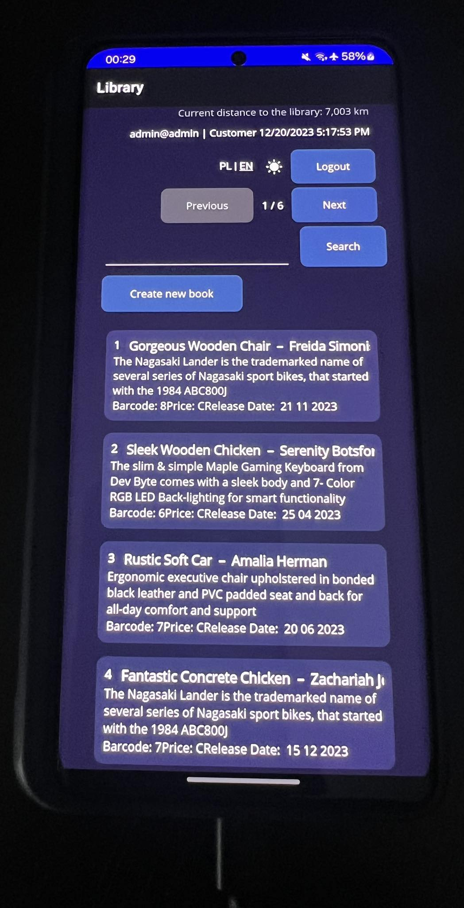
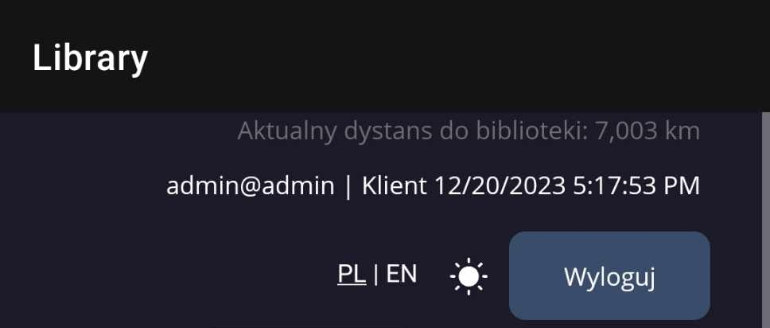

# Projekt na programowanie aplikacji mobilnych i webowych

## Wstęp

Projekt miał na celu stworzenie zestawu aplikacji: interfejsu API, aplikacji typu desktop, aplikacji WebAssembly oraz aplikacji mobilnej. Do realizacji zadania posłużyłem się projektami wykonywanymi na laboratoriach. Wykorzystałem rozwiązania od Microsoftu w języku C#:
- internetowy interfejs API platformy ASP.NET Core
- aplikacja WPF
- aplikacja Blazor WebAssembly
- aplikacja MAUI

API oraz baza danych SQL zostały przeniesione do **Google Cloud Platform**, dzięki temu mamy do nich publiczny dostęp.

API znajduje się pod adresem: https://handy-freedom-408622.nw.r.appspot.com. Możemy przetestować jego działanie w przeglądarce wykorzystując dostępny (bez wymaganej autentykacji) endpoint pobierania ilości wszystkich książek w bibliotece (żądanie typu GET): https://handy-freedom-408622.nw.r.appspot.com/api/book/count-all.

## Internetowy interfejs API

Aplikacje desktop oraz WebAssembly można uruchomić w dwóch środowiskach: **Development** i **Production**. Aby je zmienić należy odpowiednio ustawić zmienną środowiskową **ASPNETCORE_ENVIRONMENT** na **Development** lub **Production**.

W środowisku **Development** do prawidłowego funkcjonowania wymagany jest uruchomiony projekt **P05Library.API**, natomiast w przypadku **Production** posługujemy się publicznym adresem do API działającego na serwerze w Google Cloud Platform.

Metody zmiany środowiska uruchomieniowego w konkretnych projektach:
- **P04Library.Client** – zmiana zmiennej środowiskoej *ASPNETCORE_ENVIRONMENT* ustawianej podczas startu w: *Właściwości projektu* -> *Debuguj* -> *Interfejs użytkownika otwartych profilów uruchamiania debugowania*
- **P11BlazorWebAssembly.Client** – przez ograniczenia związane z typem projektu należy zmienić używaną ścieżkę *BaseAPIUrl* w plilu *appsettings.json* wybierając jedną z dwóch podanych
- **P12MAUI.Client** – środowisko można zmienić jedynie w przypadku uruchomienia na platformie Windows (na Androidzie nie mamy postawionego serwera API na adresie *localhost*), w celu zmiany należy ustawić wartość zmiennej środowiskowej *ASPNETCORE_ENVIRONMENT* w systemie


## Wdrożenie API do usługi chmurowej

Wykorzystałem usługę **App Engine** w Google Cloud Platform. Aby przeprowadzić wdrożenie przygotowałem specjalną wersję projektu **P05Library.API** (znajdującą się w katalogu **DeployedAPI**), w której obniżyłem środowisko dotnet do wersji 6.0 oraz scaliłem serwisy z projektu **P06Library.Shared**, ponieważ było to wymagane przez Google Cloud Platform (obsługiwane wdrożenie **jednego** pliku projektu w wersji **dotnet 6.0**).

Aby wdrożyć projekt umieściłem w jego katalogu plik **app.yaml** zawierający odpowiednią konfigurację środowiska:

```yaml
runtime: aspnetcore
env: flex

runtime_config:
  operating_system: ubuntu22

manual_scaling:
  instances: 1
resources:
  cpu: 1
  memory_gb: 0.5
  disk_size_gb: 10
```

Następnie posłużyłem się Google Cloud CLI, najpierw odpowiednio komendami: ***gcloud init***, ustawiłem aktualny projekt ***gcloud config set project handy-freedom-408622***. Przy skonfigurowanym środowisku uruchomiłem wdrożenie poprzez ***gcloud app deploy app.yaml***. Po wdrożeniu można otworzyć stronę w przeglądarce poprzez ***gcloud app browse*** (w naszym przypadku będzie pusta, bo jest to projekt API).

## Wspólna warstwa serwisów

Serwisy wspólne dla aplikacji desktop, WebAssembly oraz mobilnej wydzieliłem do osobnego projektu **P06Library.Shared**. Są to między innymi serwisy służące do autentykacji, zarządzania biblioteką oraz serwis tłumaczeń. W omawianym projekcie znajdują się również modele obiektów transferu danych oraz ustawień (*AppSettings*).

W każdej aplikacji klienta zostaje utworzona pojedyncza instancja (*singleton*) obiektu *AppSettings*, którą następnie wstrzykujemy do serwisów zapisanych w projekcie *P06Library.Shared*.

## Bezpieczeństwo

Wszystkie aplikacje do komunikacji wykorzystują tokeny JWT, które są wydawane przez serwer API na 1 dzień.

W części żądaniach do serwisu API jest wymagane podanie tokenu upoważniającego nas do uzyskania dostępu do żądanych treści (dokładna lista książek, itp.), przy czym niektóre żądania mogą zostać obsłużone bez tokenu (liczba wszystkich książek). Pozwala to na ograniczenie dostępu do wrażliwych dla biblioteki danych jedynie dla zalogowanych użytkowników.

**Aplikacja WebAssembly**

W aplikacji WebAssembly strona z listą książek, jak i wszystkie strony z formularzami do edycji danych, zostały zabezpieczone poprzez autoryzację wbudowaną w Blazor WebAssembly – wymagane jest bycie zalogowanym użytkownikiem w celu uzyskania dostępu do wymienionych stron.

## Wygląd interfejsów aplikacji oraz obsługa ustawień użytkownika

Każda aplikacja ma wbudowaną możliwość zmiany motywu (**jasny**/**ciemny**) oraz języka (**angielski**/**polski**). Wszystkie programy mają ten sam styl wizualny:

**Aplikacja desktop (WPF)**


**P11BlazorWebAssembly.Client**


**P12MAUI.Client**


**P05Library.API** - interfejs Swaggera pokazujący zdefiniowane endpointy interfejsu API


**Prezentacja motywów i języków**

Motywy i języki można łatwo zmienić klikając na ikony znajdujące się na stronie głównej w każdej aplikacji. Zostały użyte ikony w postaci wektorowej, co zapewnia bezstratną jakość przy dowolnym powiększeniu oraz jednakową stylistykę w aplikacji. Ikony pozyskałem z biblioteki bootstrap – użyłem zapisu SVG udostępnionego na stronie biblioteki: https://icons.getbootstrap.com/ (w projekcie Blazor WebAssembly ikony bootstrap zostały skonfigurowane i można ich użyć wykorzystując odpowiednią wartość atrybutu **class**).


**Spójność wizualna**

Wszystkie interfejsy zostały zaprojektowane tak, by implementowały spójną stylistykę. W każdym projekcie wykorzystano te same style wizualne, które można zobaczyć na powyższych zdjęciach.

**Oczekiwanie na dłuższe operacje**

Każda długa operacja (ładowania, logowania, itp.) została zasygnalizowana animacją ładującego się koła.


**Walidacja danych**

Wprowadzane we wszystkich formularzach dane są walidowane zarówno w API (odpowiedź zawiera komunikat błędu), jak i w UI (użytkownik dostaje stosowny komunikat w formie odpowiadającej dla danej platformy).

## Logowanie i rejestracja poprzez Facebooka

We wszystkich aplikacjach został zaimplementowany własny schemat logowania z wykorzystaniem autentykacji poprzez serwis Facebook. Schemat jest następujący:
- W aplikacjach klienckich zostaje otwarta przeglądarka z adresem URL wskazującym na endpoint w API
- Serwer API przekierowuje nas na odpowiednio utworzony adres do API Facebooka, wraz ze zdefiniowanym adresem ***redirect_uri*** – adres, na który zostaniemy przekierowani po zakończeniu autentykacji w serwisie
- Przeglądarka sprawdza przekierowywane adresy, gdy rozpozna utworzony adres ***redirect_uri*** wczytuje z niego uzyskany kod
- Kod jest wysyłany do API
- Serwer API uzyskuje token użytkownika od Facebooka, dzięki któremu możemy pozyskać dane o zalogowanym użytkowniku (dane, na które się zgodziliśmy podczas autentykacji, czyli adres e-mail oraz nazwa konta)
- Serwer API generuje token i wysyła go w odpowiedzi żądania do aplikacji klienta

## Kompatybilność aplikacji mobilnej

Aplikacja mobilna korzysta z wdrożonego w Google Cloud Platform serwisu API. Aplikację MAUI można uruchomić na platformie Windows oraz Android. W ramach testowania działania na Androidzie podłączyłem telefon do komputera z włączoną opcją debugowania poprzez USB (opcję należy wcześniej włączyć w ukrytych opcjach programistycznych w systemie), co pozwoliło na instalację wszystkich niezbędnych składników w oprogramowaniu telefonu.



## Serwis GPS w aplikacji mobilnej

W aplikacji mobilnej wykorzystałem serwis geolokalizacji do wyznaczenia odległości do Biblioteki Głównej PW.

Co 3 sekundy zostaje ponownie wczytana aktualna lokalizacja, po czym aplikacja dokonuje obliczenia odległości do zapisanych koordynatów biblioteki. Następnie odświeża informację wyświetloną w postaci przyszarzonego tekstu u góry ekranu. Odległość została podana w km. Cały rezultat możemy zobaczyć na poniższym zdjęciu:  



## Napotkane problemy

W aplikacji mobilnej uruchomionej na systemie Android, chcąc dokonać autentykacji poprzez Facebooka, dostaniemy komunikat o błędzie – logowanie w Androidzie do Facebooka we wbudowanej przeglądarce zostało wyłączone i nie można tego obejść. Oznacza to, że nie możemy w na tej platformie wykorzystać serwera API do przeprowadzenia logowania poprzez Facebooka.

**Problem nie występuje w przypadku uruchomienia projektu MAUI na platformie Windows, jak i wszystkie pozostałe aplikacje w pełni obsługują logowanie i rejestrację poprzez Facebooka.**


